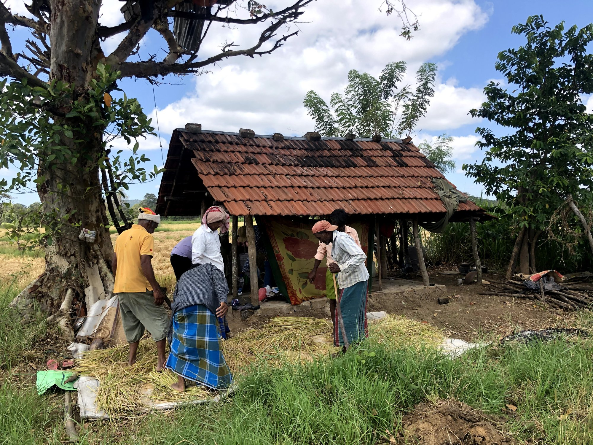
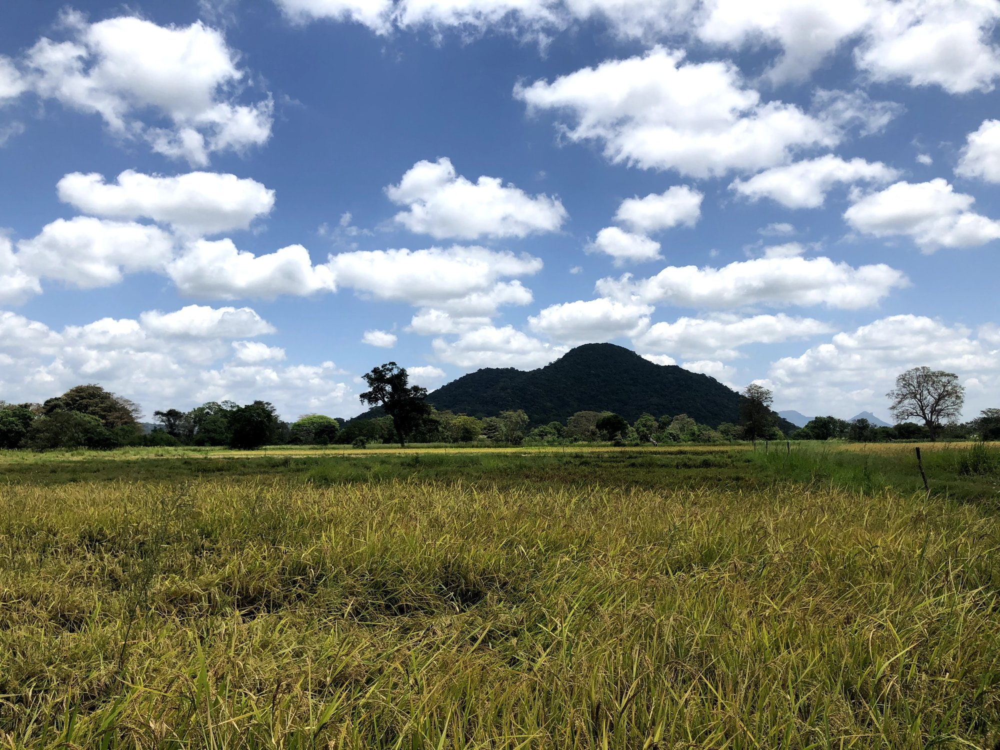
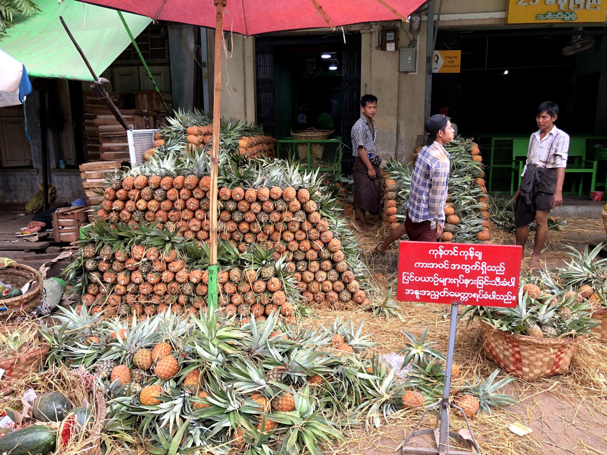
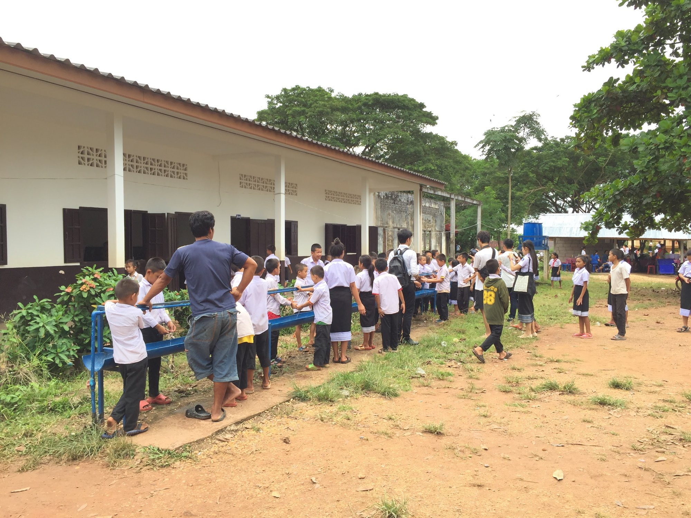
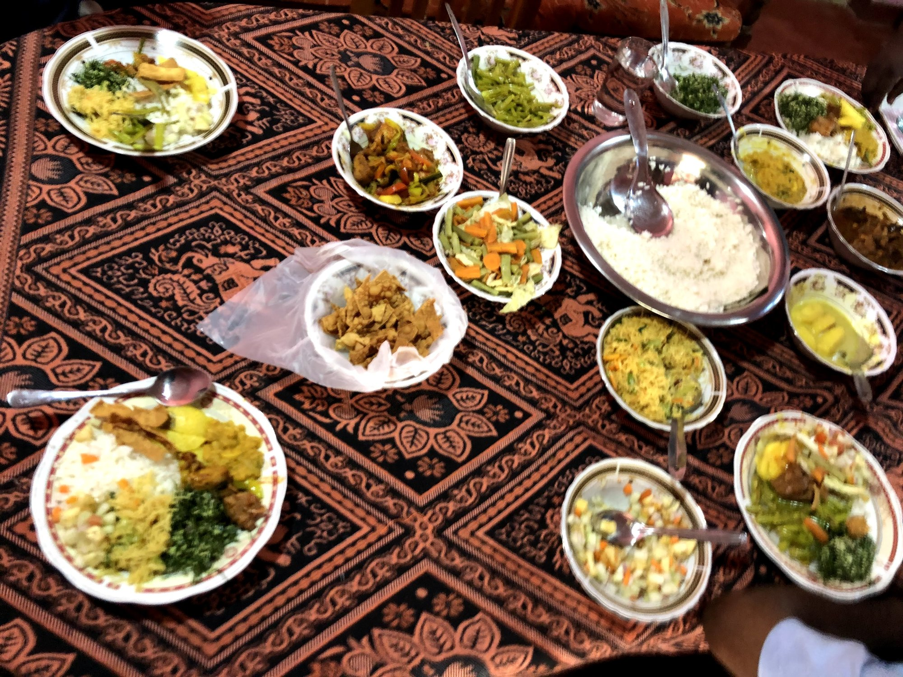
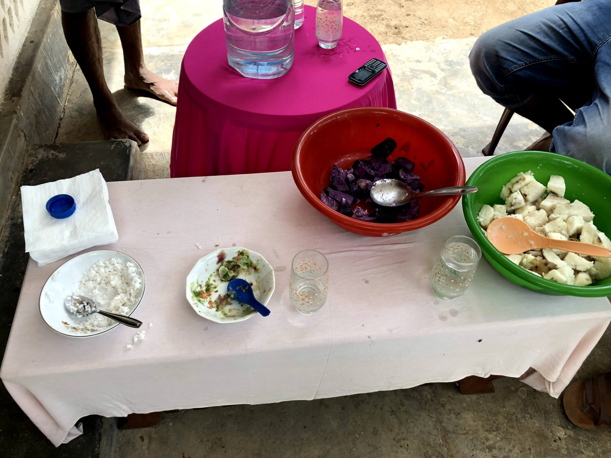

::: {.fieldwork-gallery}

{group="fieldwork-gallery" loading="lazy" fig-alt="Rice harvesting during fieldwork"}

{group="fieldwork-gallery" loading="lazy" fig-alt="Rice fields and surrounding landscape"}

{group="fieldwork-gallery" loading="lazy" fig-alt="Pineapples at a wholesale market"}

{group="fieldwork-gallery" loading="lazy" fig-alt="School visit during fieldwork"}

{group="fieldwork-gallery" loading="lazy" fig-alt="A shared meal during fieldwork"}

{group="fieldwork-gallery" loading="lazy" fig-alt="Food sampling during fieldwork"}

:::
